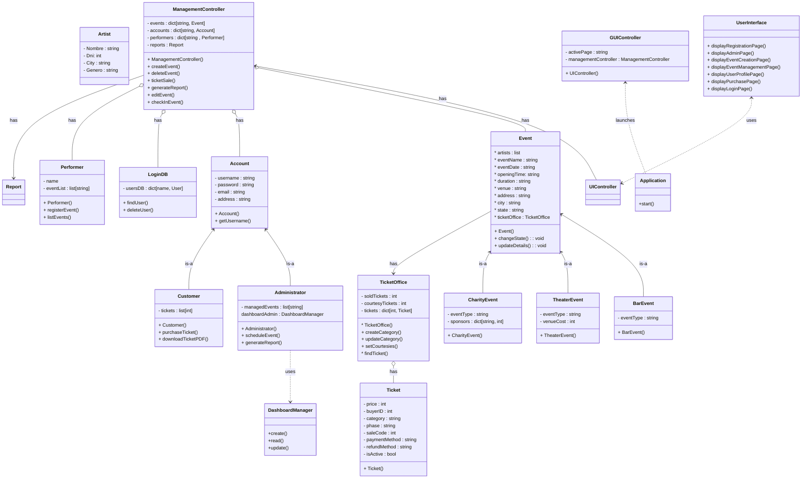

# Proyecto Final Programación Orientada a Objetos
# Proyecto Website Comediantes

##### Integrantes:
- Juan David Niño Galvis
- Juan David Tabares

##### Version 0.1.0:

- Se implementó el sistema de rating para calificar cada show con una estrella entre 1 y 5, además que estas propiedades ya se pueden modificar en la sección "Modificar evento"
- Se Solucionaron los errores para graficar los eventos que eran creados en el calendar_mode que se encuentra al visualizar los eventos, se creo una función que convierte un objeto "Event" en un JSON que pueda leer el custom component
- Se actualizo el requirements.txt con la nueva dependencia "st_star_rating"
- Mejoras visuales en general de todo el proyecto
- Se crearon algunos Eventos y Tickets por defecto para facilitar en la visualización del sistema, esto para la demo review proxima.

##### Version 0.0.5:

- Se implementó una vista para visualizar los eventos y los tickets que son creados temporalmente
- Se solucionaron los errores al momento de crear un evento dependiendo del tipo elegido
- se actualizó el requirements.txt con las nuevas dependencias necesitadas, ""pip install -r requirements.txt"
- Implementó la compra de Ticket y exportacion de información como archivo PDF

##### Creación del Logo:

Para la creación del logo para nuestra plataforma de comedia utilizamos una inteligencia artificial llamada "Leonardo AI" la cual nos da distintas posiblidades a elegir, y tomar la que más nos gusté.

##### Librerias Utilizadas

- streamlit-Lottie:
- Font Awesome and Boostrap icons

Esta la utilizamos para mejorar la estetica del proyecto, esta funciona como un banco de diseños y animaciones para llamar facilemente mientras desarrollamos

## Objetivos Planteados

- New: Agregar Distintas excepciones
- Vista de Usuario
- Dashboard para Administrador
- Vista de Login para identificar el usuario o Administrador
- Vista de Artistas
- Vista de Publicidad
- Buscar mejores maneras de almacenar datos, leer y escribir en formatos seguros.
- Vista de Reportes, uso de pandas para crear graficas y estadisticas para imprimir en esta sección.

Nota: Aún no sabemos como podemos representar los reportes, probablemente sea con una clase
# Vistas del proyecto

- Login User
- Dashboard
- Creacion Evento (Admin)
- Compra de Evento (Usuario)

